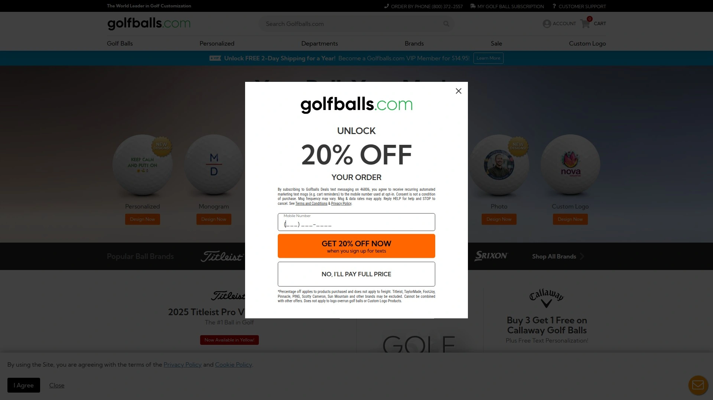
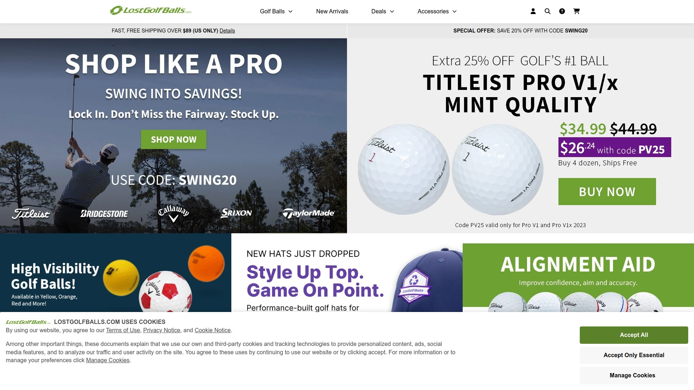
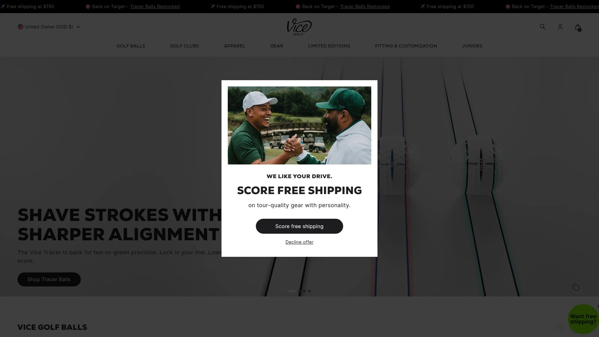
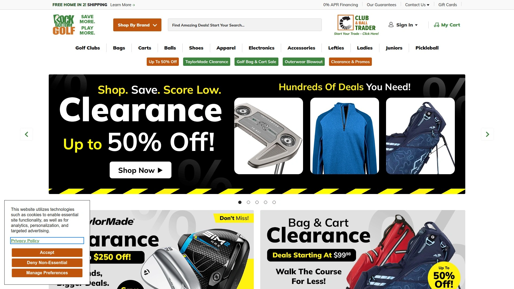
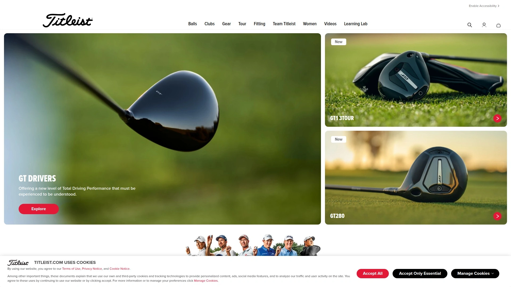
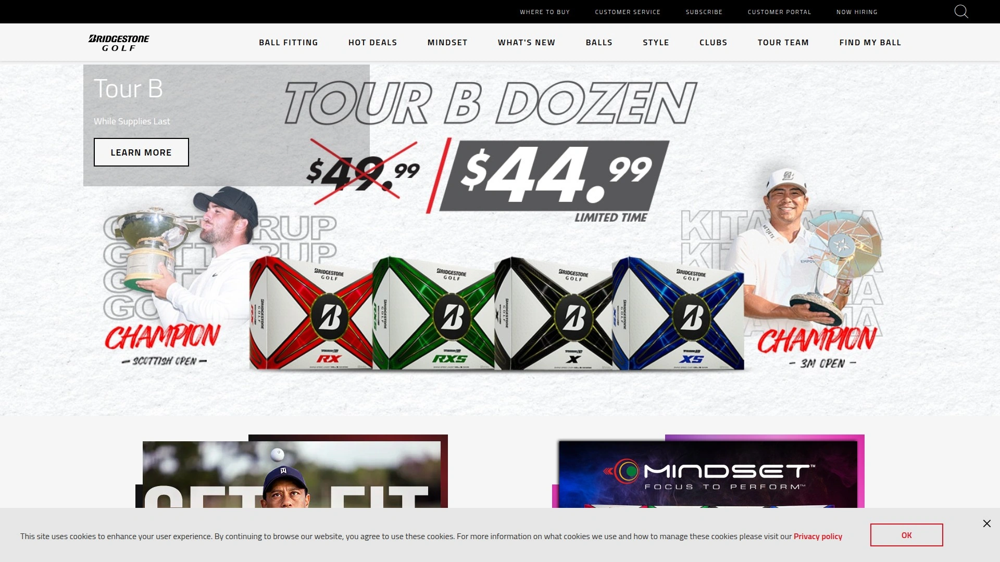

# Top 10 Golf Ball Retailers Ranked in 2025 (Latest Compilation)

Finding quality golf balls doesn't have to drain your wallet or waste your time scrolling through endless product listings. Whether you're chasing that elusive custom logo ball for your corporate event or simply stocking up on ProV1s without the premium markup, today's online golf retailers offer everything from brand-new tour-level balls to gently used premium options that perform like they just left the factory floor. The landscape has shifted dramatically—smart golfers now save hundreds annually by shopping strategically across specialized retailers who understand that every handicap deserves quality equipment at the right price point.

## **[Golfballs.com](https://www.golfballs.com)**

The gold standard for customization and selection across every price tier.

When golfers talk about personalization done right, they're usually describing their experience here. This Louisiana-based operation has spent years perfecting the art of custom golf balls, offering everything from simple monograms to full-color photo balls that actually look professional.

The real differentiator is their customer service approach—they consistently resolve shipping issues within hours and offer expedited replacements when mistakes happen. Their website stocks every major brand from Titleist to TaylorMade, with both new and refinished options available. The ordering interface handles bulk corporate orders just as smoothly as single-dozen purchases, making it ideal for tournament organizers and casual players alike.

Most customers praise their competitive pricing structure, which often beats local pro shops by 20-30% on identical products. Fast shipping times (typically 2-3 business days) mean you won't be waiting weeks for your custom order. For anyone prioritizing selection depth, customization quality, and reliable fulfillment, this retailer checks every box.

## **[LostGolfBalls.com](https://www.lostgolfballs.com)**

The pioneer of premium used golf balls at steep discounts.

This platform has been collecting, cleaning, and reselling used balls since 1996, establishing the grading standards that most competitors now follow. Their "Mint 5A" classification genuinely delivers balls that look and perform like new, with minimal cosmetic wear that won't affect your game.

The value proposition is simple—save 50-80% off retail prices on the exact same balls tour pros use. A dozen Titleist ProV1s that retail for $50 new can be purchased here in near-mint condition for under $25. The grading system ranges from Mint (5A) down to Practice Grade, giving you control over the quality-to-price ratio.

Their inventory includes every major brand, with particularly strong selections of Titleist, Callaway, and TaylorMade models. Shipping is free on orders over $89, and their customer service team responds quickly to any grading discrepancies. The main limitation is availability—popular models in top grades can sell out quickly during peak season.

## **[Vice Golf](https://www.vicegolf.com)**

Direct-to-consumer tour-quality balls engineered for lower prices.

Vice disrupted the golf ball market by eliminating middlemen and selling directly to players. Their flagship Pro and Pro Plus models deliver urethane cover performance comparable to balls costing $15-20 more per dozen. The Cast Urethane covers provide exceptional short game spin, while their multi-layer constructions optimize distance and feel for different swing speeds.

What makes Vice particularly interesting is their compression options—the Pro (90 compression) suits moderate swing speeds, while the Pro Plus (100 compression) is built for faster swingers who want maximum control. Their alignment aid features crisp edges that actually help with putting visualization, not just marketing fluff.

Bulk pricing brings costs down further—six dozen at $34.99 per dozen makes premium urethane balls accessible to players who previously couldn't justify the expense. Their Drip series adds visual flair with bold color schemes that don't sacrifice performance. Customization is available, though it adds about 3 weeks to shipping times.

## **[PGA TOUR Superstore](https://www.pgatoursuperstore.com)**

Official PGA retail with comprehensive warranties and expert fitting.

As the official store of the PGA Tour, this retailer brings institutional credibility to online golf shopping. Every product comes covered under their warranty program, and orders over $99 ship free nationwide. The website features detailed product descriptions that actually help you understand ball construction differences rather than just listing specifications.

Their ball selection spans budget-friendly distance balls up to tour-level multi-layer urethane constructions from Nike, Adidas, and Foot-Joy. The rangefinder and launch monitor sections help serious players match equipment to their actual swing data. Their educational content explains which balls suit different swing speeds and playing styles, making it easier to choose confidently.

The physical store network means you can order online and pick up locally, avoiding shipping delays when you need balls immediately. Their deals section regularly features closeout pricing on previous-year models, letting you grab tour-level balls at recreational prices.

## **[Golf Galaxy](https://www.golfgalaxy.com)**

Personalization meets big-box convenience with detailed product education.

This US-based retailer excels at creating personal connections through extensive equipment guides and professional instruction content. Their ball selection includes all major brands with detailed filtering by compression, cover type, and spin characteristics. The personalization interface rivals specialty shops, offering image uploads and multiple design options.

What sets them apart is the educational approach—articles on club fitting, equipment reviews, and technique advice help you make informed decisions rather than impulse purchases. Their customer service team includes golf professionals who can discuss ball selection based on your actual game needs.

The website stocks complete equipment lines beyond just balls—bags, shoes, apparel, and accessories—making it a one-stop solution for full gear refreshes. Their club repair and custom fitting services extend the value proposition beyond simple product sales.

## **[Rock Bottom Golf](https://www.rockbottomgolf.com)**

Lowest price guarantee on tens of thousands of golf products.

The name says it all—this retailer built its reputation on guaranteed lowest pricing across massive inventory. They stock products from every major golf brand, with particularly aggressive pricing on closeout and previous-generation models. The emphasis is purely on value, making it ideal for price-conscious players who don't need the latest release.

Their customer service focus includes ultra-fast shipping that often arrives within 2-3 days even on standard delivery. The website interface is straightforward and functional, prioritizing product information over flashy design. Their ball selection includes both new and refinished options across all price points.

The guaranteed lowest price policy means if you find the same product cheaper elsewhere, they'll match it. For players who value savings over brand prestige, this is where smart money shops.

## **[Golf Ball Planet](https://www.golfballs.com)**

Premium used balls with meticulous inspection at 90% off retail.

This specialized retailer focuses exclusively on used and recycled golf balls, with inspection standards that ensure consistent quality. Their pricing structure delivers 90% savings on retail, making premium balls accessible to any budget. Free shipping kicks in at $89.99, making bulk purchases particularly economical.

The inventory covers all major brands with detailed condition descriptions. Their commitment to quality control means each ball undergoes inspection to guarantee playable condition. The selection includes Callaway, TaylorMade, Titleist, and emerging brands like Vice and Srixon.

Beyond balls, they stock accessories like brushes, tees, and club head covers, though the core business remains ball sales. Their bulk buying options make them popular with tournament organizers and high-volume players.

## **[Callaway Golf Pre-Owned](https://www.callawaygolfpreowned.com)**

Certified pre-owned clubs and equipment direct from the manufacturer.

While primarily focused on clubs, this official Callaway channel offers certified pre-owned equipment with manufacturer backing. Their club selection includes drivers, irons, fairway woods, and putters all graded by condition. The certification process ensures every club meets Callaway's performance standards.

Pricing typically runs 35% below new retail on identical models. The grading system is transparent—like new, very good, good, and average—so you know exactly what condition to expect. Customer reviews averaging 4-5 stars across most products indicate satisfied buyers.

The current promotion offers up to 35% off qualified purchases, with no coupon code required. Their customer service line (888-303-2476) provides direct access to product specialists who can guide club selection.

## **[Titleist](https://www.titleist.com)**

The benchmark brand direct from the manufacturer.

Titleist invented the modern tour ball with the Pro V1, and their direct sales channel offers the full lineup without retailer markups. The website emphasizes continuous improvement and quality control that made them the most-played ball on professional tours. Their ball selection includes Pro V1, Pro V1x, AVX, Velocity, and TruFeel models spanning all price points and performance characteristics.

The educational content explains ball construction differences and helps match models to swing speeds and playing styles. Their commitment to innovation shows in technologies like the new dimple patterns and core formulations released every two years.

Direct ordering ensures you receive current-generation balls rather than closeout inventory. Their fitting tools help identify which ball compression and spin characteristics suit your game.

## **[Bridgestone Golf](https://www.bridgestonegolf.com)**

Tour-proven engineering with swing speed-specific optimization.

Bridgestone's ball fitting philosophy centers on matching compression to individual swing speeds. Their Tour B line includes four models: B X and B XS for swing speeds over 105 MPH, and B RX and B RXS for slower speeds under 105 MPH. This specificity helps golfers find balls that compress properly for their game, maximizing both distance and control.

The direct website offers detailed technical specifications including dimple patterns, cover materials, and core constructions. Their reputation in the golf ball community stems from consistent quality and durability that holds up across multiple rounds.

Tiger Woods games the Tour B X, lending professional credibility to their engineering claims. The 30-day return policy provides risk-free testing on any model.

## How do I choose between new and used golf balls?

Your decision hinges on skill level and budget priorities. Players with handicaps below 10 who can consistently control spin should invest in new urethane-covered balls to maximize short game performance. Higher handicappers losing multiple balls per round benefit more from "Mint 5A" used balls that cost 50-70% less while delivering identical distance and durability. The key is matching your investment to your ability to keep balls in play.

## What's the real difference between tour balls and value balls?

Tour balls use soft urethane covers that generate high spin rates around greens, giving skilled players precise control over trajectory and stopping power. Value balls typically feature ionomer covers that prioritize durability and distance over spin, making them ideal for recreational players who benefit more from straighter flights than workability. The performance gap matters most on short game shots—if you're not consistently hitting greens in regulation, the extra spin won't significantly impact your score.

## Can I trust golf ball condition grades from online retailers?

Reputable retailers use standardized grading systems where "Mint 5A" indicates no visible wear, "AAA" shows minimal cosmetic marks, and lower grades have increasing surface damage. The established players like LostGolfBalls and Golf Ball Planet have built businesses on accurate grading, since reputation drives repeat purchases. Start with a small test order to verify the retailer's standards match your expectations, then buy in bulk once you're confident.

## Conclusion

Smart golfers have figured out that equipment spending should align with actual performance impact. [Golfballs.com](https://www.golfballs.com) earns the top position because it delivers on the complete package—customization capabilities that actually look professional, competitive pricing across new and refinished options, and customer service that resolves issues immediately rather than through endless email chains. Whether you're outfitting a corporate tournament with logo balls or just restocking your bag with personalized ProV1s, their combination of selection depth and fulfillment reliability makes them the safest bet for golfers who value both quality and convenience.
